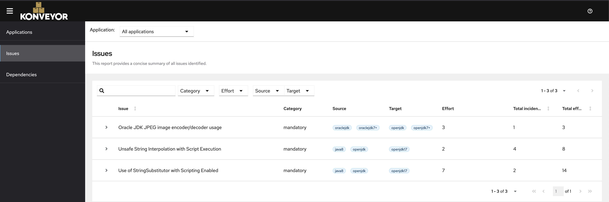

This is an example project for custom rules using kantra

## Usecase:
>* Apache Commons Text performs variable interpolation, allowing properties to be dynamically evaluated and expanded. The standard format for interpolation is "${prefix:name}", where "prefix" is used to locate an instance of org.apache.commons.text.lookup.StringLookup that performs the interpolation. Starting with version 1.5 and continuing through 1.9, the set of default Lookup instances included interpolators that could result in arbitrary code execution or contact with remote servers. These lookups are: - "script" - execute expressions using the JVM script execution engine (javax.script) - "dns" - resolve dns records - "url" - load values from urls, including from remote servers Applications using the interpolation defaults in the affected versions may be vulnerable to remote code execution or unintentional contact with remote servers if untrusted configuration values are used. Users are recommended to upgrade to Apache Commons Text 1.10.0, which disables the problematic interpolators by default.


## Steps to reproduce

### Installation
1. Download kantra [here](https://github.com/konveyor/kantra/releases)
2. Extract the archive

3. Rename Kantra cli and move it to PATH. 
```bash
 mv darwin-kantra kantra
```

4. Add all the files from the extracted folder into `.kantra` 
```bash
 cd kantra.darwin.arm64/
 mv $HOME/bin/kantra .

```
5. run the analysis
```bash
kantra analyze --input=tests/data/ssti-test-project --output=output --overwrite  --target openjdk17
 --rules rules
```

Now you can open the report from Kantra into the browser e.g. 
file:///somepath/demo-custom-rules/security/output/static-report/index.html#/issues/applications

